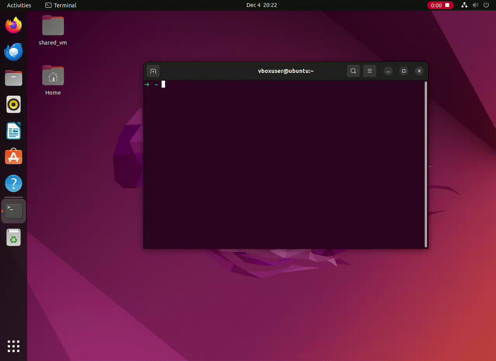

# npl-to-zsh

## Brief Description
`npl-to-zsh` is a cutting-edge tool that seamlessly integrates Natural Language Processing (NLP) services, like OpenAI, with the Zsh command line. It allows users to type commands in plain English and receive command line suggestions, enhancing the user experience and efficiency.

## Disclaimer
**Use at Your Own Risk**: This tool is provided without any guarantees or warranty. It sends data from the command line buffer to OpenAI or other NLP services. Note that the commands generated may not always work as expected and could potentially cause harm to your system resulting in data loss. Please proceed with caution and at your own risk. Thsi is intened as a tool to learn the linux command line faster than ever before.

## What it Does and How to Use
Simply type what you want to do in plain English and press `Ctrl+G`. Choose from the listed options, and the command will magically appear in your command line buffer. 

**Supported Systems**: `npl-to-zsh` is fine-tuned and tested primarily for GNU/Linux systems. MacOS users might experience certain limitations.

## Setup and Installation
1. **Download Repo**: Clone this repository using Git.
2. **Install Dependencies**: Ensure Zsh, Python3, and FZF are installed on your Linux system.
3. **Python Requirements**: Install the Python dependencies listed in `requirements.txt`.
4. **Script Installation**: Place `ask_gpt.py` in `/usr/local/bin/` and set it to executable with `sudo chmod +x /usr/local/bin/ask_gpt.py`. Move `npl-to.zsh` to `/usr/local/bin/` and make it executable `sudo chmod +x /usr/local/bin/npl-to.zsh`.
5. **Shell Integration**: Append your `.zshrc` file with `source /usr/local/bin/npl-to.zsh`, `export OPENAI_API_KEY='your_key_here'`, `export OPENAI_MODEL_NAME='your model here'` .

### OpenAI Setup
- **API Key**: Obtain an API key from OpenAI. [Click here for instructions](link_to_openai_api_key_setup).
- **Model Options**: You can either use my fine-tuned model or fine-tune your own using the provided dataset.
   - **Fine-Tuned Model**: Quick and easy setup. No editing the python script
   - **Custom Fine-Tuning Your Owwn model**: Offers more control and customization. A working model costs like 6 cents

## Future Plans and Features
- Automated testing environment for safe command learning. I invision this as a workflow of pressing CRTL-G then selecting between models, then choosing (even modifying one-line script), finally, selecting wether to run on your system, in docker, chroot, take lvm snapshot etc.
- Caching mechanism for previous results these request are very cheap but it could be useful. Possibly a small RAG (retrival agumented generation) or nlu
- Enhanced fine-tuning dataset. I'm just learning how to fine tune models. I'm sure i made mistakes and the data set could be much bigger and better.
- Support for local models using the Transformers library, likely running on Flask at a loopback address. Privacy is important to me and lamas/huggign face community makes running npl on your local machine possible with consumer hardware.

## Inspiration
A long time ago (early 2000s), when i first started using linux, I really didn't know much about programming and in general how computers worked. Being completely honest I thought npl was already thing, given that google searchs implemented at least some forms of nlu. Anyway, learning the linux command-line was very tricky and intimidating, and I remeber often wishing at times that i could just use natural lnaguage and accomplish what i wanted to do quickly. Unfortuanly i had to grind out the basics and pratice to get proficent at it. Fast forward to today and, thankfully, you don't have. I hope this tool acts a beast for you to learn the command line quickly and effectivly.

## Credits
Developed by Brendan with signifiant help from ChatGPT (AI is great for generating code and avoiding spending all your time reading docs and recalling syntax, but it doesn't come up with it's own ideas, it can setup enviroments and test them, redesign the architicture and iterate over ideas/ code, ultimatly finding a solution that someone can actually use. GPT wrote the scripts but I promoted it and told it waht libaries to use and how it should work). All contributions are deeply appreciated.

Enjoy using `npl-to-zsh`!